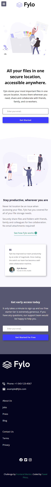
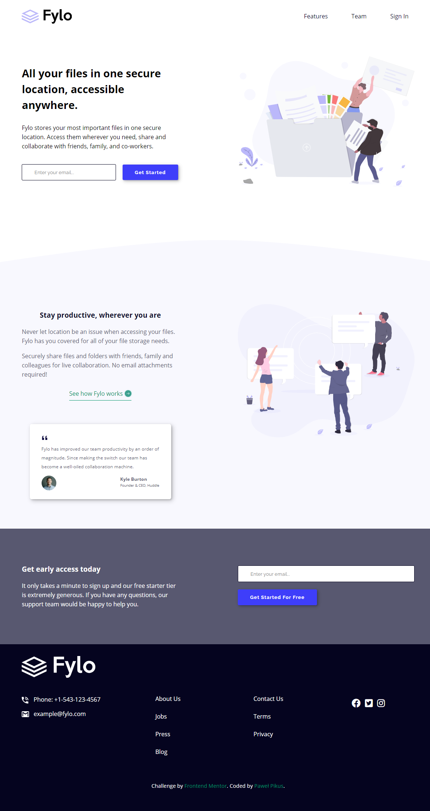

# Frontend Mentor - Fylo landing page with two column layout solution

This is a solution to the [Fylo landing page with two column layout challenge on Frontend Mentor](https://www.frontendmentor.io/challenges/fylo-landing-page-with-two-column-layout-5ca5ef041e82137ec91a50f5). Frontend Mentor challenges help you improve your coding skills by building realistic projects. 

## Table of contents

- [Overview](#overview)
  - [The challenge](#the-challenge)
  - [Screenshots](#screenshot)
  - [Links](#links)
- [My process](#my-process)
  - [Built with](#built-with)
  - [What I learned](#what-i-learned)
  - [Continued development](#continued-development)
  - [Useful resources](#useful-resources)
- [Author](#author)
- [Acknowledgments](#acknowledgments)

## Overview

### The challenge

Users should be able to:

- View the optimal layout for the site depending on their device's screen size
- See hover states for all interactive elements on the page

### Screenshots





### Links

- Solution URL: [solution](https://github.com/pawelpikus/fylo-landing-page)
- Live Site URL: [live site](https://pawelpikus.github.io/fylo-landing-page/)

## My process

### Built with

- Semantic HTML5 markup
- CSS custom properties
- Flexbox
- Mobile-first workflow

### What I learned

With this challenge I trained the concept of Responsive Web Design. I tried to push the requirements of this challenge a little bit further and build a fully responsive design. To accomplish that, I used: 

- the concept of desktop-first markup, putting content into semantic, logical chunks and laying it out with flexbox, whenever I could (flexbox rules!), e.g.:    

```html
<section class="section section-cta">
      <div class="container d-flex">
        <div class="cta-primary">
          <h1 class="section-title">All your files in one secure location, accessible anywhere.</h1>
          <p>Fylo stores your most important files in one secure location.
            Access them wherever you need, share and collaborate with friends,
            family, and co-workers.</p>
          <form class="cta-form">
            <input class="cta-input" type="email" required placeholder="Enter your email...">
            <input class="cta-btn" type="submit" value="Get Started">
          </form>
        </div>
        
      </div>
    </section>
```
- using a combination of relative and absolute units in css for responsive layout, e.g.: 

```css
container {
    max-width: 1200px;
    width: 90%;
    margin: 0 auto;

}
```
or like this:

```css
.logo-img{
    height: 40px;
    margin-top: 1em;
}

.curved-line-bg{
    width: 100vw;
}
```

- adding media queries to address wider screens, e.g.:

```css
@media (min-width: 800px) {

    /* layout */
    .d-flex{
        flex-direction: row;
        justify-content: space-between;
        align-items: flex-start;
    }

```

### Continued development

I'm going to focus on more complex layouts, preferably using CSS Grid and then focus on incorporating JS into my layouts.

### Useful resources

- [Kevin Powell | CSS Evangelist](https://www.kevinpowell.co/) - My favourite teacher for RWD and CSS as a whole. Highly recommend it!

## Author

- Website - [Paweł Pikus | Github](https://github.com/pawelpikus)
- Frontend Mentor - [@pawelpikus](https://https://www.frontendmentor.io/profile/pawelpikus)
- Twitter - [@yourusername](https://www.twitter.com/yourusername)

**Note: Delete this note and add/remove/edit lines above based on what links you'd like to share.**

## Acknowledgments

Big credit to all frontendmentor.io crew and supporters for creating an amazing opportunity for wannabies to become pros. Respect! 


